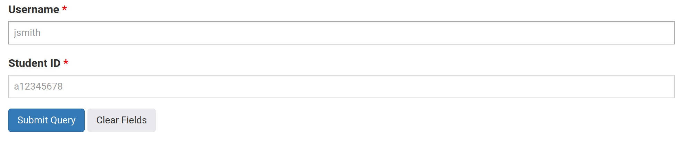
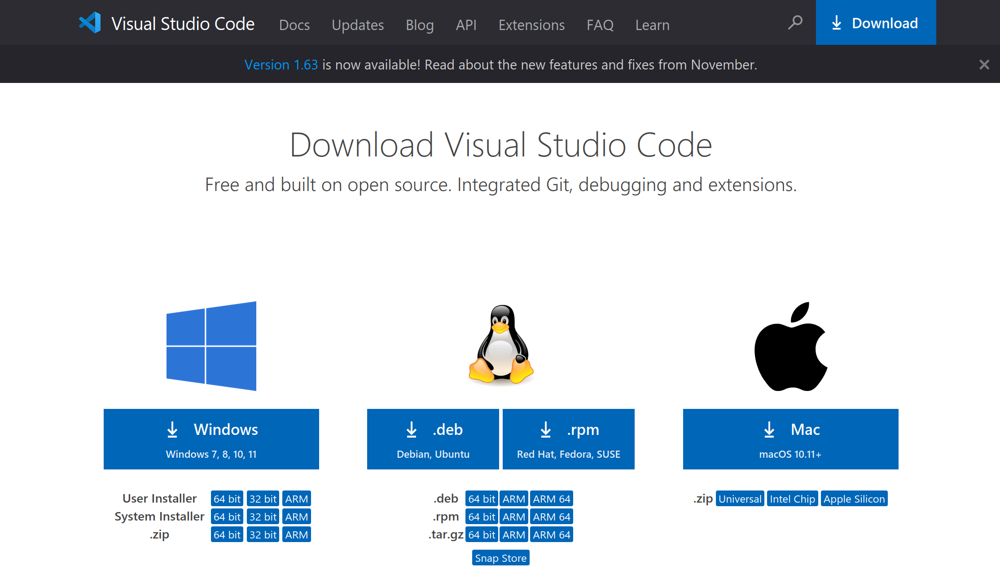
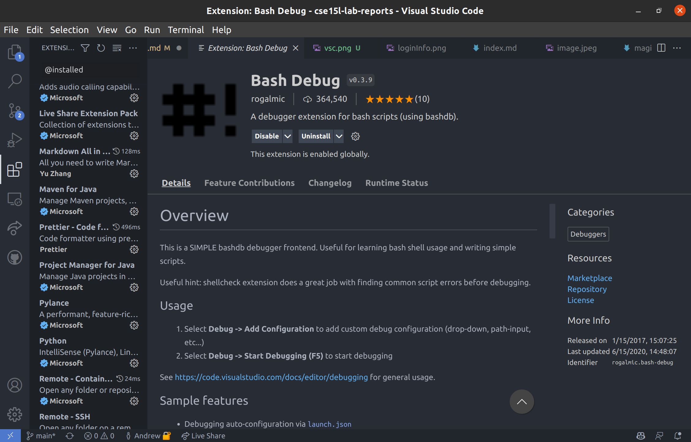
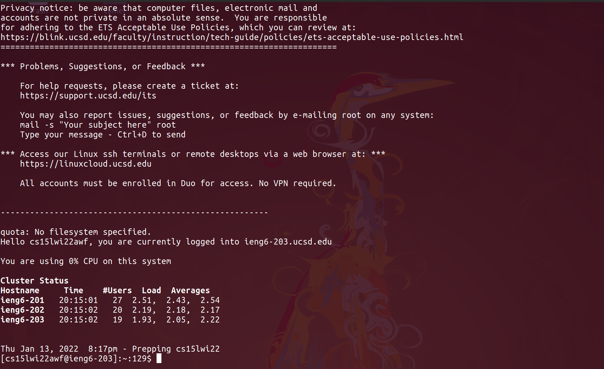
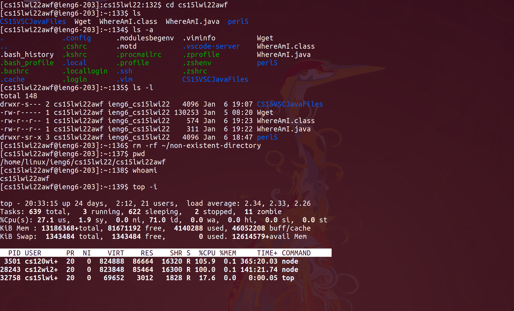
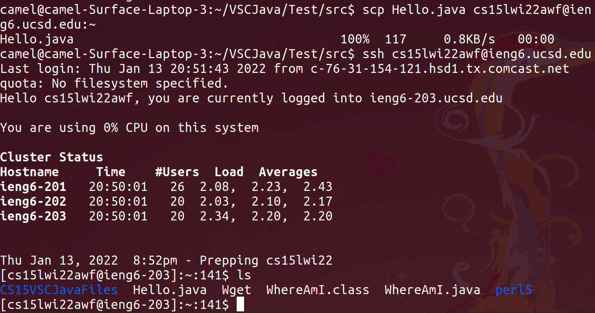
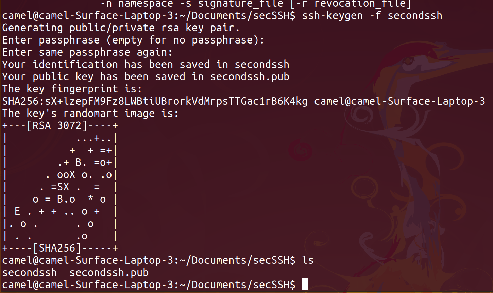
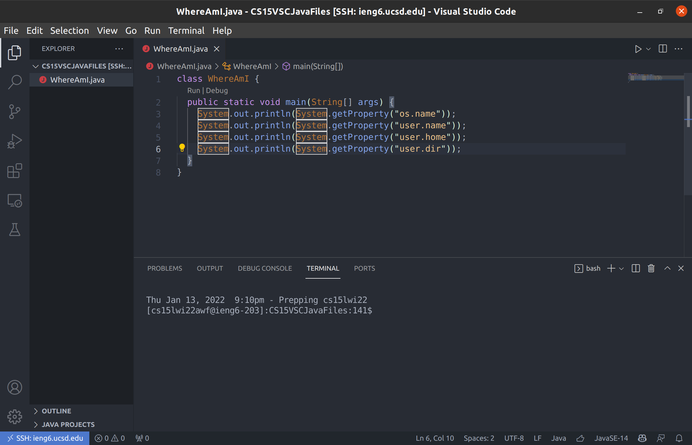
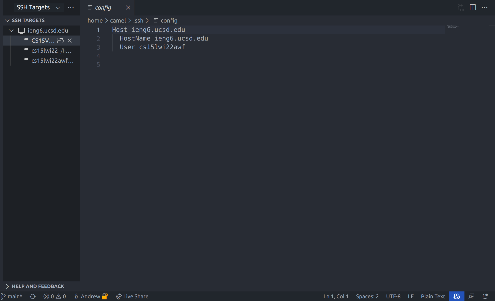

# How to log into ieng6
## 1. Find your CSE15l account information
The way to log into ieng6 account is to first get the login info by clicking on this [link](https://sdacs.ucsd.edu/~icc/index.php). This should direct you to a page that looks like this:

After getting to this page, input your username and student ID and click **Submit Query**.

After finding the account that says CS15L, one should change the password of that account and make a note of your new password and your account username.

## 2. Install VSCode
Your second step should be installing vscode, which can be done [here](https://code.visualstudio.com/download). After downloading, I ran the installer and configured it however I wanted.

Personally I like to have as many extensions as possible running at the same time on mine, which looks like this:

extensions that I found specifically useful for remote access are linked [here](https://marketplace.visualstudio.com/items?itemName=ms-vscode-remote.remote-ssh) and [here](https://marketplace.visualstudio.com/items?itemName=ms-vscode-remote.vscode-remote-extensionpack). 
## 3. Remotely Connecting
The next step is to remotely ssh into the server. This can be done by opening a terminal, which for linux is `ctrl + alt + t` and on windows is `windows + x` and clicking command prompt. Then I entered the following command:
```
$ssh cs15lwi22zz@ieng6.ucsd.edu
```
where zz was replaced by the letters in my username from step [1](#1-find-your-cse15l-account-information). It printed out a bizarre message with regards to unknown authenticity of the server:
```
The authenticity of host 'ieng6.ucsd.edu (128.54.70.227)' can't be established.
RSA key fingerprint is SHA256:ksruYwhnYH+sySHnHAtLUHngrPEyZTDl/1x99wUQcec.
Are you sure you want to continue connecting (yes/no/[fingerprint])? 
```
If the IP is correct and the SHA256 fingerprint is correct, typing yes is safe.
Then I typed in my password that I set in step [1](#1-find-your-cse15l-account-information) and my terminal looked something like this:

## 4. Trying Some Commands
The next to do is to try running some commands on the server. The server is running linux, so here are some quick commands I tried running from the terminal: <br>
1. cd ..
2. ls -a
3. ls -l
4. rm -rf ~/non-existent-directory
5. pwd
6. whoami
7. top -i
8. ps -ef  
</ul>
which will look like this after finishing:



## 5. Moving files with scp
To move files with SCP, we need to first stop controlling the cse server and run commands on our own desktop, this can be done by entering the command `ctrl + d` in the terminal. Then we need to specify a filename to copy over, I chose a file that is called **Hello.Java** which simply prints "Hello World"
```
public class Hello {
    public static void main(String[] args) {
        System.out.println("Hello World");
    }
}
```
To copy the file over, type the command:
```
scp Hello.java cs15lwi22zz@ieng6.ucsd.edu:~/
```
where **Hello.java** is replaced by whatever file you want to send over and **cs15lwi22zz@ieng6.ucsd.edu** is replaced by your username. After entering your password, this should send the file to your home directory:

## 6. Setting up an SSH Key
The next step is to create an SSH Key. I made mine the first time by just running the command `$ssh-keygen` in the terminal. 

After doing this, I had to copy the .pub file from my local computer to the server. I did it through these commands:
```
ssh cs15lwi22zz@ieng6.ucsd.edu
mkdir .ssh
ctrl + d
scp $HOME/.ssh/id_rsa.pub cs15lwi22zz@ieng6.ucsd.edu:~/authorized_keys
```
where **cs15lwi22zz@ieng6.ucsd.edu** is replaced with your username, and **id_rsa.pub** is possibly replaced with the name of the .pub file.
Once this is done, we are able to login to the server without entering a password.
## 7. Optimizing Remote Running
The final step is to optimize running remotely, I personally installed the vscode extensions and set it up so that I could simply one click the bottom left corner in VSCode to ssh into the server and edit files in the server.
<br>
This currently looks like this:


which I setup using the extensions linked [above](#2-install-vscode). The setup is to edit a ".config" file so that it looks similar to this:

# Thanks for reading my lab report!
