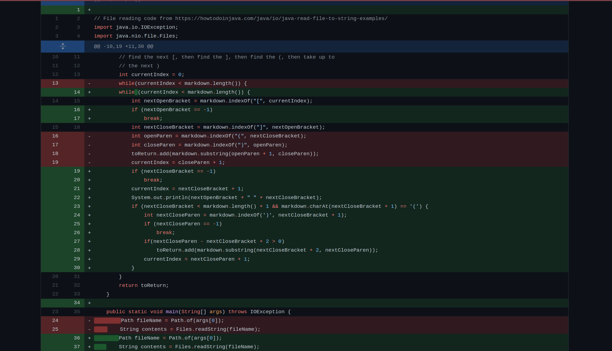
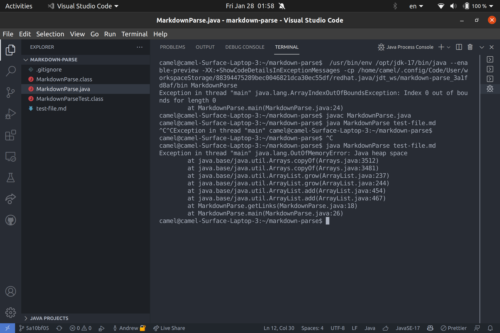
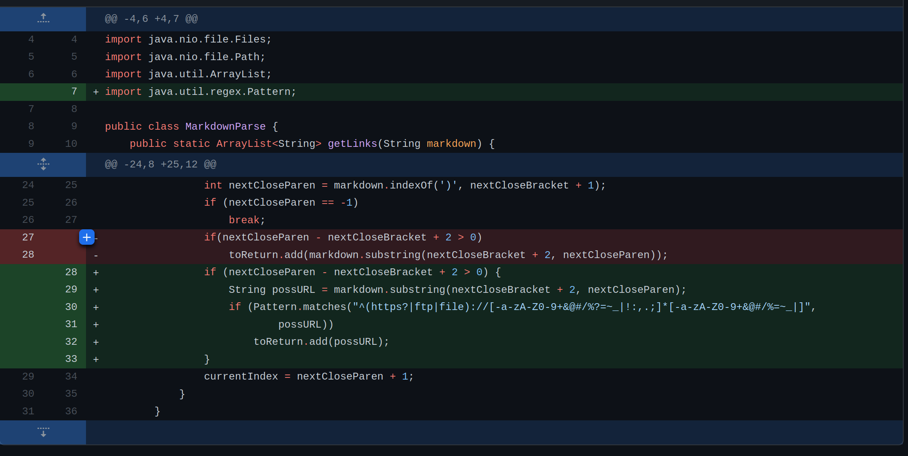
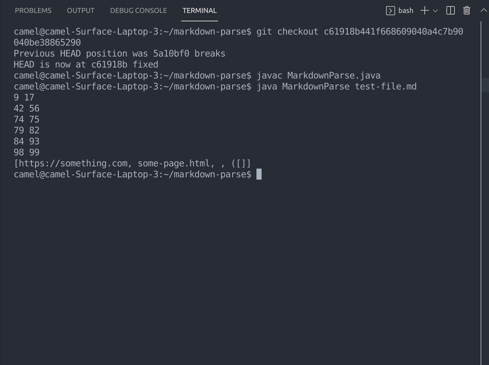
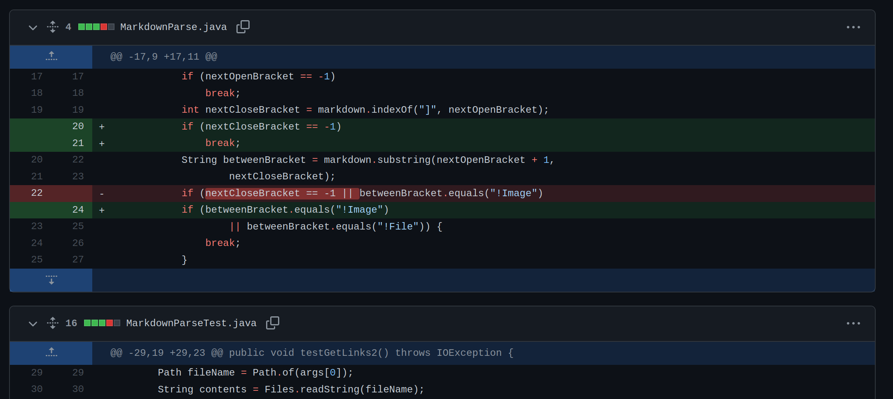
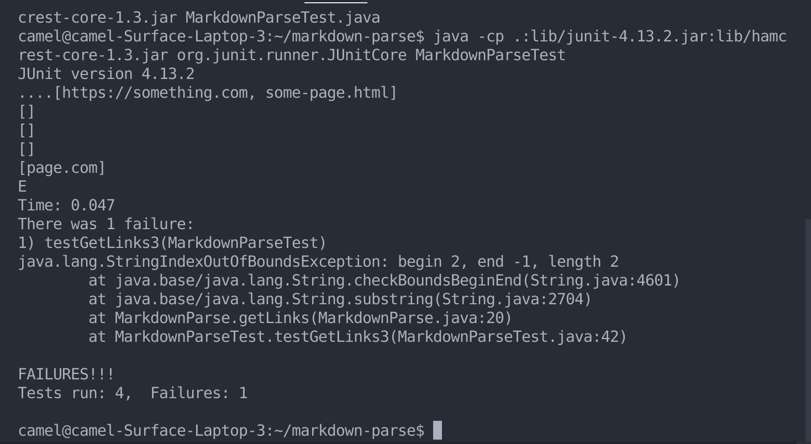

# Lab Report Bug Fixing
## First Bug Fixed:
My first bug fixed was dealing with incorrectly formatted or empty links.
The program was throwing an exception rather than ignoring it like the real markdown would do so I fixed it.

Attached is a screenschot of the code change difference of my first commit:

The input that caused the original bug is linked [here](https://github.com/wandwan/markdown-parse/blob/main/test-file.md).
The symptom of the failure inducing input is an exception thrown when it shouldn't be. Screenshot below:

The fix is to check for empty links and correctly formatted links. The symptom of the bug is an out of memory error, while the bug itself is a simple infinite loop in the while loop that comes from the incorrect format of the link.
The failure inducing input is simply any input that causes the index function to return -1, which resets the while loop counter and causes the program to continue to run.
## Second Bug Fixed:
My second bug fixed was the incorrect handling of invalid URLs, where a good markdown parser program should only link to valid urls, my program accepted any type of input in between parenthesis as an URL. Here is a screenshot of the changes made to the code:

The fix is to check for the correct format of the URL, which is to have a protocol, a colon, and a slash. I used Regex to accomplish this. Attached is a link to the failure inducing [input](https://github.com/wandwan/markdown-parse/commit/5a10bf05939a5b2cc13c72eb4532f214be922d4b). It causes a weird sequences of brackets and parenthesis to be passed to be accepted as a URL, as shown below.

The failure inducing input is an incorrectly formatted URL, which causes the symptom of the program linking to a non-existent page. The bug was closely tied to the symptom, as it simply required me to check for correctly formatted links.
## Third Bug Fixed:
The final bug I had was similar to the first one, but this time my substring that I used to check for valid links was returning an error.
Here is an image of how I fixed it:

The fix is to check the bounds of String.substring(). Attached is a link to the failure inducing [input](https://github.com/wandwan/markdown-parse/commit/5eaddc0ffe889004c1696106a2154dc14348c4da). Here is the symptom of the bug, failing unit tests with an exception:

The failure inducing input was a bracket that had no closing bracket, which meant that the substring would be between a positive number and negative one, thereby triggering an index out of bounds exception for string.substring, which was the symptom. The bug was caused by forgetting assuming the bounds would always be valid when calling substring.