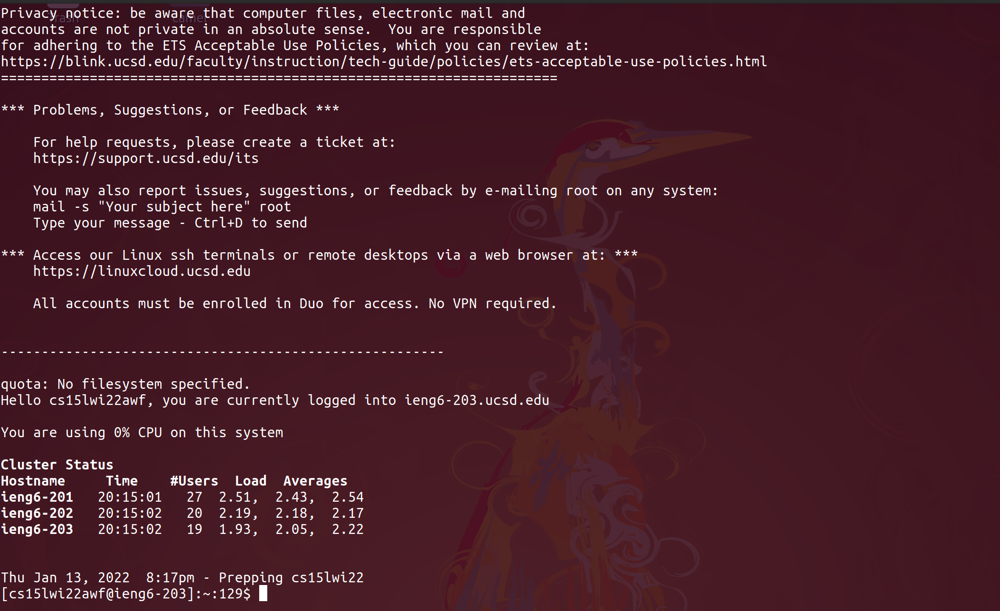

# How to log into ieng6
## 1. Find your CSE15l account information
The way to log into ieng6 account is to first get your login info by clicking on this [link](https://sdacs.ucsd.edu/~icc/index.php). This should direct you to a page that looks like this:

After getting to this page, input your username and student ID and click **Submit Query**.

After finding the account that says CS15L, you should change the password of that account and make a note of your new password and your account username.

## 2. Install VSCode
Your second step should be installing vscode, which can be done [here](https://code.visualstudio.com/download). After downloading, run the installer and configure it the way you want.

Personally I like to have as many extensions as possible running at the same time on mine, which looks like this:

extensions that I found specifically useful for remote access are linked [here](https://marketplace.visualstudio.com/items?itemName=ms-vscode-remote.remote-ssh) and [here](https://marketplace.visualstudio.com/items?itemName=ms-vscode-remote.vscode-remote-extensionpack). 
## Remotely Connecting
The next step is to remotely ssh into the server. This can be done by opening a terminal, which for linux is `ctrl + alt + t` and on windows is `windows + x` and clicking command prompt. Then you should enter the following command:
```
$ssh cs15lwi22zz@ieng6.ucsd.edu
```
where zz is replaced by the letters in your username from step [1](#1-find-your-cse15l-account-information). (Windows users might first have to install openSSH).<br>
If this is your first time connecting to the server, it will print out a bizarre message with regards to unknown authenticity of the server:
```
The authenticity of host 'ieng6.ucsd.edu (128.54.70.227)' can't be established.
RSA key fingerprint is SHA256:ksruYwhnYH+sySHnHAtLUHngrPEyZTDl/1x99wUQcec.
Are you sure you want to continue connecting (yes/no/[fingerprint])? 
```
If the IP is correct and the SHA256 fingerprint is correct, typing yes is safe.
Then you should type your password that you set in step [1](#1-find-your-cse15l-account-information) and your terminal will then look like this:


