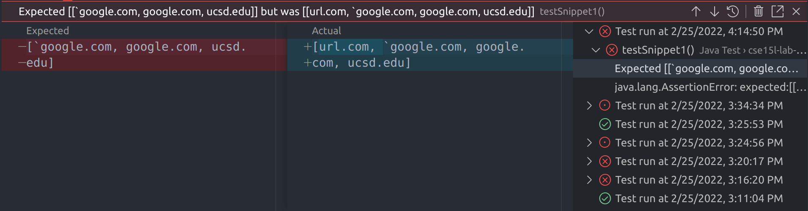
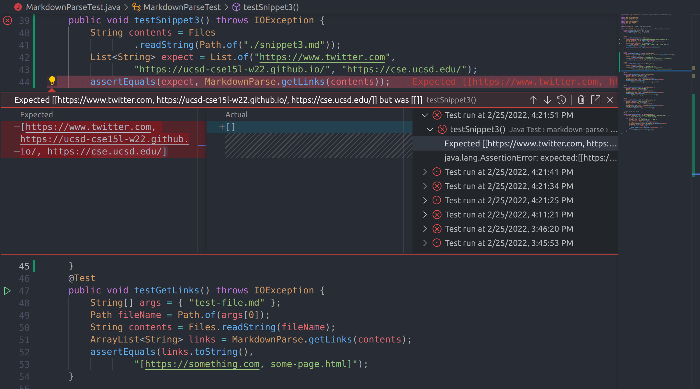
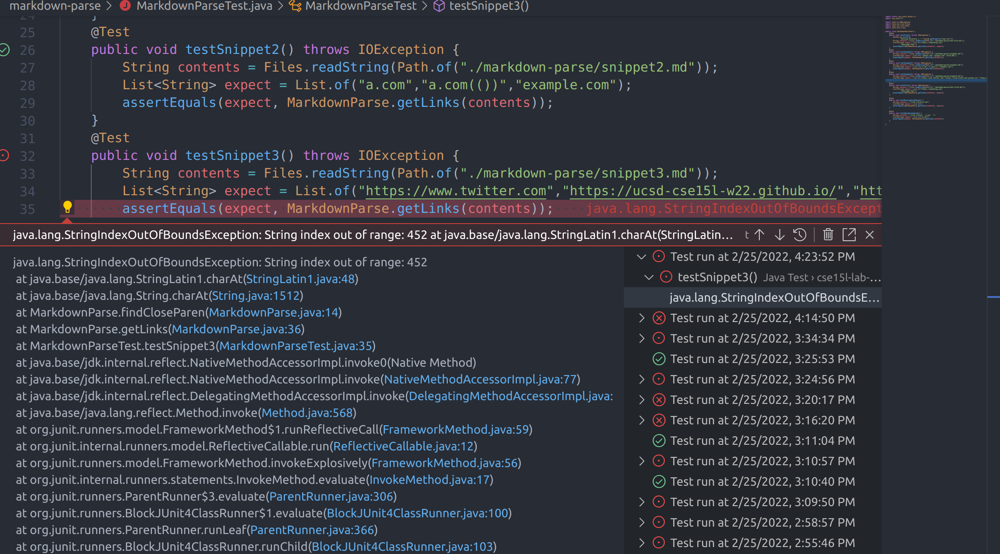

 # Lab Report 3
 ## Snippet #1.
 Here is my code for testing Snippet 1.
 ```
    @Test
    public void testSnippet1() throws IOException {
        String contents = Files.readString(Path.of("./markdown-parse/snippet1.md"));
        List<String> expect = List.of("`google.com","google.com","ucsd.edu");
        assertEquals(expect, MarkdownParse.getLinks(contents));
    }
 ```
This test makes my implementation fail. Here is the output:


This is the output of the test against the person I reviewed (Joe Politz):



## Snippet #2.
Here is my code for testing Snippet 2.
```
@Test
    public void testSnippet2() throws IOException {
        String contents = Files.readString(Path.of("./markdown-parse/snippet2.md"));
        List<String> expect = List.of("a.com","a.com(())","example.com");
        assertEquals(expect, MarkdownParse.getLinks(contents));
    }
```
This test passes the implementation I wrote.
This test also passes the implementation I reviewed (Joe Politz).

## Snippet #3.
Here is my code for testing Snippet 3.
```
    @Test
    public void testSnippet3() throws IOException {
        String contents = Files.readString(Path.of("./markdown-parse/snippet3.md"));
        List<String> expect = List.of("https://www.twitter.com","https://ucsd-cse15l-w22.github.io/","https://cse.ucsd.edu/");
        assertEquals(expect, MarkdownParse.getLinks(contents));
    }
```
This test makes my implementation fail. Here is the output:



This is the output of the test against the person I reviewed (Joe Politz):



## Answers to questions: 

Question #1:
I do not think there is a small code change that can fix my program. I think the best way to implement this fix is with some sort of automata. This would require a complete rewrite.
The reason that it's difficult is because you have to define being "inside backticks" and also there might exist backticks that don't close which means you have to rollback and fix state and properly parse brackets. Also there could be a lot of backticks in one bracket or parenthesis which means you have to use a loop.

Question #2:
My program already works for snippet 2.

Question #3:
Yes. I can probably just ignore newlines while in brackets. All I would have to do is keep track of the nearest "\n" and use it to reset my bracket counts.
