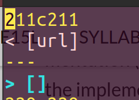
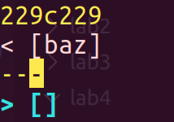

# Lab Report 5
We cloned both repos, copied the tests and script to both and then ran diff on the output of the two commands.
I didn't search through manually, I just read diff to pick two tests. I edited the script.sh file to show which test is after a line number, and then I picked the two tests that were corresponding to mine.

## Question 1

The correct output is [my_(url)]
This is my first test, test 194.md, where I get a different result from the supposed result. Both implementations are flawed as specified by commonmark. This is because after a : you need to read the next string as a link.
The issue is I have no code for parsing a : so there is no code to show.
``` 
no code to show since I didn't implement : detection.
```




## Question 2

The correct output is []
This is my second test, test 201.md, where I get the correct output of empty, while they get [baz], the reason I am correct and they are wrong is becuase they are not accounting for spaces and other stuff after the brackets. This is not easy to fix. You can use a regex to find it.
```
int nextCloseBracket = markdown.indexOf("]", nextOpenBracket);
int openParen = markdown.indexOf("(", nextCloseBracket);

// The close paren we need may not be the next one in the file
int closeParen = findCloseParen(markdown, openParen);

if(nextOpenBracket == -1 || nextCloseBracket == -1
        || closeParen == -1 || openParen == -1) {
    return toReturn;
}
String potentialLink = markdown.substring(openParen + 1, closeParen).trim();
if(potentialLink.indexOf(" ") == -1 && potentialLink.indexOf("\n") == -1) {
    toReturn.add(potentialLink);
    currentIndex = closeParen + 1;
}
```


